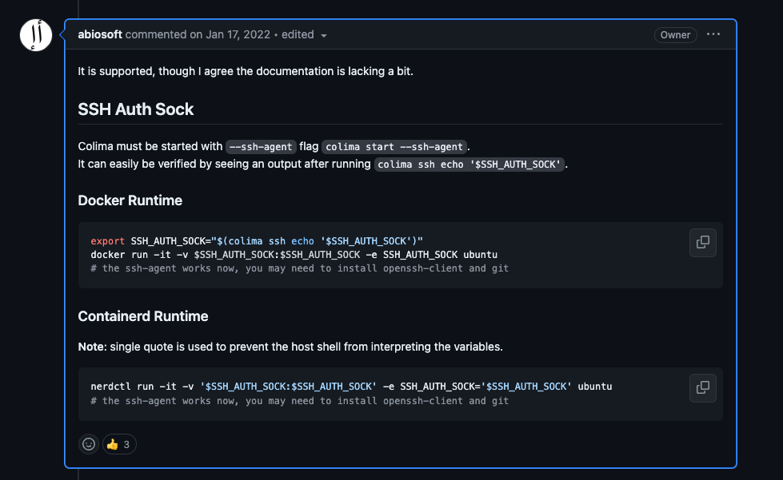

# Colima SSH Agent Script on MacOS

This repository contains a script to share the SSH agent with a Colima container.

## Overview

The `ssh-agent-forward-colima.sh` script simplifies the process of sharing your SSH agent with a Colima container. This is useful for accessing remote servers or services from within the container without having to copy your SSH keys into the container.

## Prerequisites

- [Colima](https://github.com/abiosoft/colima) installed and configured on your system.
- SSH keys configured and added to your SSH agent.


## Reference 

Link: [https://github.com/abiosoft/colima/issues/127#issuecomment-1014474574](https://github.com/abiosoft/colima/issues/127#issuecomment-1014474574)

## Usage

1. **Clone the Repository**:
    ```bash
    git clone git@github.com:gustavoguarda/ssh-agent-forward-colima.git
    cd ssh-agent-forward-colima
    ```

2. **Make the Script Executable**:
    ```bash
    chmod +x ssh-agent-forward-colima.sh
    ```

3. **Source and run the Script**:
    ```bash
    source ssh-agent-forward-colima.sh
    ```

4. **Run the container using Docker Compose**:
    ```bash
    docker compose up
    ```

5. **Access the container**:
    ```bash
    docker compose exec ssh-client /bin/bash
    ```

6. **Verify inside the container**:
    ```bash
    ssh-add -l
    ```

## How it works

1. Stops any running Colima instance.
2. Starts the SSH agent and adds your SSH key.
3. Starts Colima with the SSH agent.
4. Sets the `SSH_AUTH_SOCK` variable for the Colima container environment.
